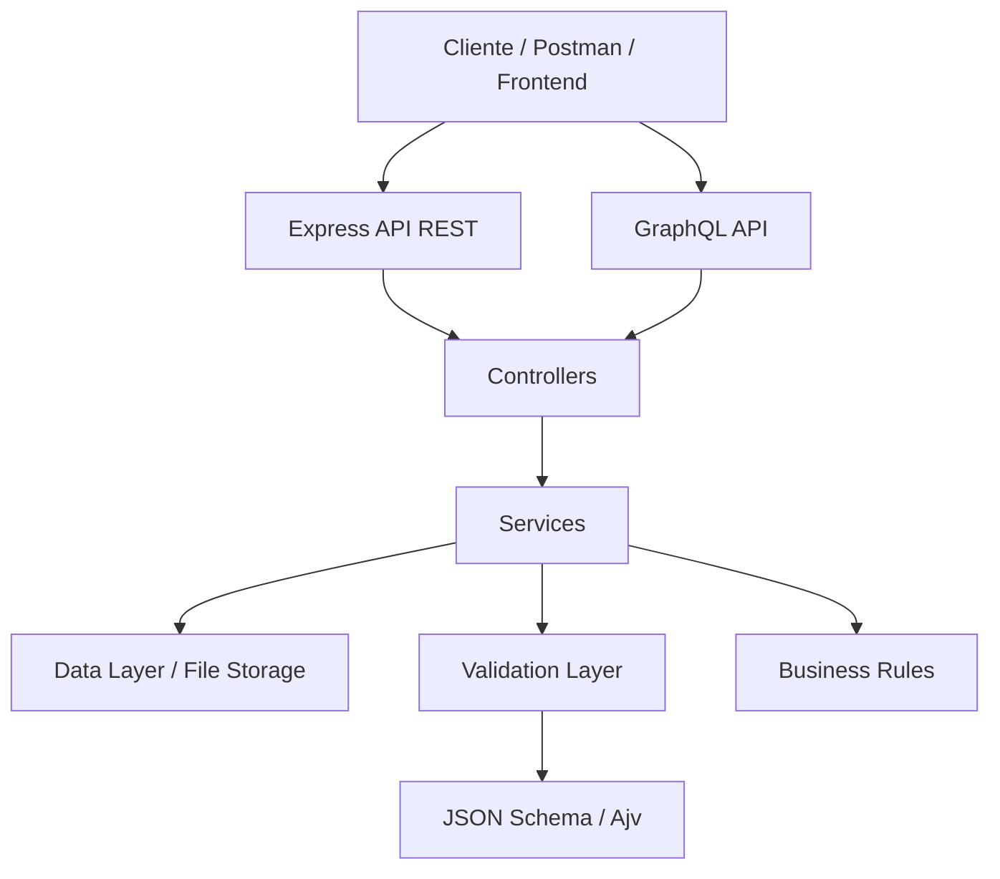
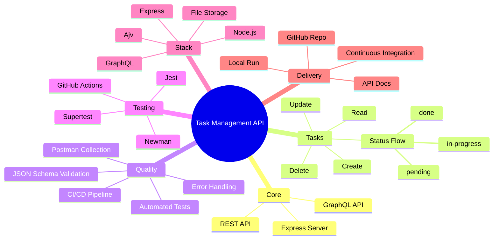

#  Task Management API

[](https://github.com/Letytorquato82/Mentoria-Julio-de-Lima/actions/workflows/ci.yml)
[](https://github.com/Letytorquato82/Mentoria-Julio-de-Lima)
[](http://localhost:3000/graphiql)

>  API REST e GraphQL para gestão de tarefas de sprint, com foco em automação de testes, validação de contratos e garantia de qualidade.

---

##  Visão Geral

Esta aplicação foi desenvolvida para demonstrar um fluxo completo de gerenciamento de tarefas em sprint, cobrindo operações de criação, leitura, atualização e exclusão de itens, além de suporte a consultas via GraphQL.

Com foco em qualidade de software, o projeto incorpora:
- testes automatizados
- validação de payloads
- boas práticas de API REST
- integração contínua com GitHub Actions

---

##  Arquitetura do Projeto


O projeto segue uma **arquitetura em camadas**, com suporte a **REST** e **GraphQL** como pontos de entrada, convergindo para os mesmos **Controllers** e **Services**.

**Fluxo:** Cliente → API (REST/GraphQL) → Controllers → Services → Data Layer, Validation Layer (JSON Schema/Ajv) e Business Rules.

Essa estrutura garante **separação de responsabilidades**, **validação centralizada** e **fácil escalabilidade**, permitindo adicionar novas funcionalidades sem impactar a lógica de negócio existente.



---

## 🧠 Mapa Mental do Projeto



---

##  Stack Tecnológica

- **Node.js** 18+
- **Express**
- **Ajv** para validação de schemas
- **GraphQL**
- **Jest + Supertest** para testes automatizados
- **Newman + Postman** para execução de coleções
- **GitHub Actions** para CI/CD

---

##  Funcionalidades

- CRUD completo de tarefas
- Controle de status: `pending`, `in-progress`, `done`
- Validação de entrada com JSON Schema
- Endpoints RESTful
- Suporte a consultas GraphQL
- Persistência local em arquivo
- Integração contínua configurada

---

##  Instalação

### 1) Clone o repositório
```bash
git clone https://github.com/Letytorquato82/Mentoria-Julio-de-Lima.git
cd Mentoria-Julio-de-Lima
```

### 2) Instale as dependências
```bash
npm install
```

### 3) Inicie a aplicação
```bash
npm start
```

### 4) Acesse a API
```text
http://localhost:3000
```

---

##  Comandos Úteis

- `npm install` — instala as dependências
- `npm start` — inicia a API
- `npm test` — executa a suíte de testes
- `npm run postman` — executa a coleção Postman via Newman
- `npm run audit:fix` — tenta corrigir vulnerabilidades de dependências

---

##  Endpoints REST

- `GET /api/tasks` — lista todas as tarefas
- `POST /api/tasks` — cria uma nova tarefa
- `GET /api/tasks/:id` — busca uma tarefa por ID
- `PUT /api/tasks/:id` — atualiza uma tarefa completa
- `PATCH /api/tasks/:id/status` — atualiza o status da tarefa
- `DELETE /api/tasks/:id` — remove uma tarefa

---

##  Exemplos de Requisição

### Listar tarefas
```bash
curl -X GET "http://localhost:3000/api/tasks"
```

### Criar tarefa
```bash
curl -X POST "http://localhost:3000/api/tasks" \
  -H "Content-Type: application/json" \
  -d '{"title":"Implementar endpoint de tarefa","description":"Criar API REST para gestão de entregas","status":"pending"}'
```

### Buscar tarefa por ID
```bash
curl -X GET "http://localhost:3000/api/tasks/1"
```

### Atualizar tarefa
```bash
curl -X PUT "http://localhost:3000/api/tasks/1" \
  -H "Content-Type: application/json" \
  -d '{"title":"Tarefa atualizada","description":"Descrição atualizada","status":"in-progress"}'
```

### Atualizar status
```bash
curl -X PATCH "http://localhost:3000/api/tasks/1/status" \
  -H "Content-Type: application/json" \
  -d '{"status":"done"}'
```

### Deletar tarefa
```bash
curl -X DELETE "http://localhost:3000/api/tasks/1"
```

---

##  Modelo de Dados

```json
{
  "title": "Implementar endpoint de tarefa",
  "description": "Criar API REST para gestão de entregas",
  "status": "pending"
}
```

### Campos
- `title`: string obrigatória
- `description`: string opcional
- `status`: enum com valores `pending`, `in-progress`, `done`

---

##  Testes

### Testes automatizados
```bash
npm test
```

### Coleção Postman
A coleção e o ambiente de teste estão localizados em:
- `postman/TaskManagement.postman_collection.json`
- `postman/TaskManagement.postman_environment.json`

---

##  GraphQL

O projeto também oferece suporte a GraphQL:

- Endpoint: `http://localhost:3000/graphql`
- Interface: `http://localhost:3000/graphiql`

### Consulta de exemplo
```graphql
query {
  tasks {
    id
    title
    description
    status
  }
}
```

### Mutation de exemplo
```graphql
mutation {
  createTask(input: { title: "Nova tarefa", description: "Descrição", status: "pending" }) {
    id
    title
    status
  }
}
```

---

##  CI/CD

O projeto inclui pipeline automatizado em GitHub Actions para:
- instalação de dependências
- execução de testes
- validação de coletânea Postman
- auditoria de vulnerabilidades

Arquivo:
- `.github/workflows/ci.yml`

---

##  Observações

- A persistência atual é local, em arquivo.
- O objetivo principal é demonstrar arquitetura, qualidade e testes em API.
- O projeto foi organizado para fácil entendimento e futura extensão.

---

##  Contato

Para dúvidas, sugestões ou melhorias, abra uma issue no repositório ou entre em contato pelo GitHub.

---

