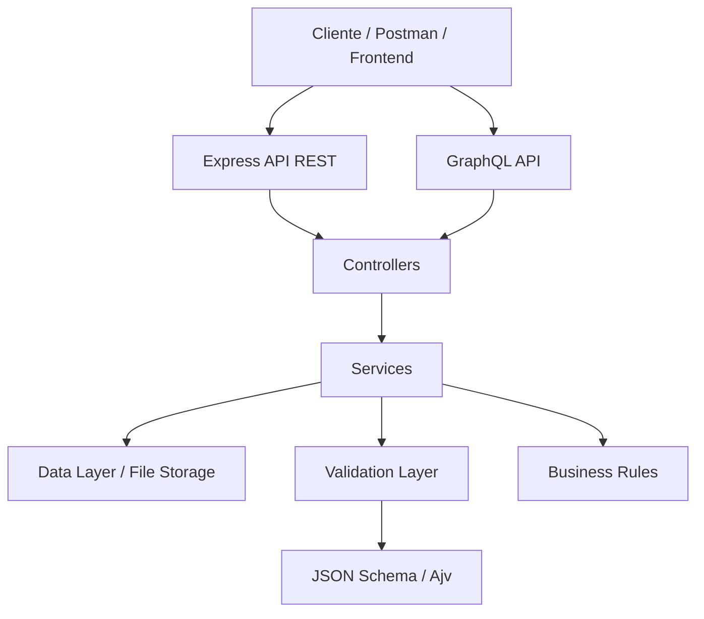
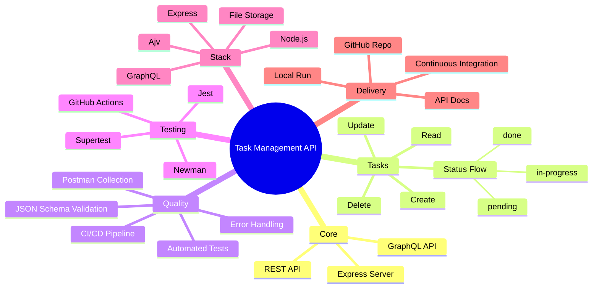

#  Task Management API

[](https://github.com/Letytorquato82/Mentoria-Julio-de-Lima/actions/workflows/ci.yml)
[](https://github.com/Letytorquato82/Mentoria-Julio-de-Lima)
[](http://localhost:3000/graphiql)

> API REST e GraphQL para gestão de tarefas de sprint, com foco em automação de testes, validação de contratos e garantia de qualidade.

---

##  Objetivo do Projeto

Este projeto foi desenvolvido para demonstrar, de ponta a ponta, a construção de uma API de gestão de tarefas (task management) aplicada a um contexto de sprint ágil, com ênfase em **qualidade de software** e **automação de testes** — competências centrais para atuação em QA/SDET e desenvolvimento backend.

Os objetivos específicos são:

- Implementar um **CRUD completo** de tarefas, cobrindo os fluxos de criação, consulta, atualização (total e parcial) e exclusão.
- Expor a mesma base de dados por **dois paradigmas de API** — REST e GraphQL — permitindo comparar abordagens de consulta e integração.
- Validar contratos de entrada com **JSON Schema (Ajv)**, garantindo que dados inconsistentes sejam rejeitados antes de chegar à camada de negócio.
- Cobrir os fluxos críticos com **testes automatizados** (Jest + Supertest) e com uma **coleção Postman/Newman** executável via linha de comando.
- Automatizar a verificação de qualidade em **pipeline de CI/CD** (GitHub Actions), incluindo testes, validação da coleção Postman e auditoria de dependências.
- Manter uma arquitetura em camadas simples de entender, testar e evoluir para uma persistência real (banco de dados) no futuro.

Em resumo: o projeto simula, em pequena escala, o ciclo de vida de uma feature de API dentro de um time ágil — da modelagem de dados à entrega com testes e pipeline automatizados.

---

##  Arquitetura do Projeto

A aplicação segue uma arquitetura em camadas, onde REST e GraphQL compartilham a mesma lógica de negócio (`Services`), evitando duplicação de regras:



### Detalhamento das camadas

- **Cliente (Postman / Frontend / curl)** — qualquer consumidor da API, seja para testes manuais, automação ou uma aplicação frontend.
- **Express API REST** — camada de rotas HTTP tradicionais (`/api/tasks`), responsável por expor o CRUD via verbos HTTP.
- **GraphQL API** — camada alternativa de acesso aos mesmos dados, via queries e mutations em um único endpoint (`/graphql`).
- **Controllers** — recebem a requisição (REST ou GraphQL), delegam para os Services e formatam a resposta (status HTTP, corpo JSON ou payload GraphQL).
- **Validation Layer (Ajv / JSON Schema)** — valida o formato e os tipos dos dados de entrada antes que cheguem à lógica de negócio, rejeitando payloads inválidos com mensagens de erro claras.
- **Services** — concentram as regras de negócio (ex.: transições de status permitidas, obrigatoriedade de campos) e a orquestração de leitura/escrita.
- **Data Layer / File Storage** — persistência local em arquivo, usada para manter o projeto simples e sem dependências externas de banco de dados. É o ponto de substituição caso o projeto evolua para um banco real (ex.: PostgreSQL, MongoDB).

### Mapa mental do projeto



---

##  Stack Tecnológica

| Tecnologia | Função no projeto |
|---|---|
| **Node.js 18+** | Runtime da aplicação |
| **Express** | Framework para a API REST |
| **GraphQL** | Camada alternativa de consulta/mutação sobre os mesmos dados |
| **Ajv** | Validação de payloads via JSON Schema |
| **Jest + Supertest** | Testes automatizados de unidade e integração |
| **Newman + Postman** | Execução da coleção de testes de API via linha de comando |
| **GitHub Actions** | Pipeline de integração contínua (CI/CD) |

---

##  Funcionalidades

### CRUD completo de tarefas
Criação, leitura (individual e em lista), atualização (total e parcial de status) e exclusão de tarefas, disponíveis tanto via REST quanto via GraphQL.

### Controle de status (workflow da tarefa)
Cada tarefa segue um fluxo de status que reflete o andamento do trabalho em sprint:

```
pending  →  in-progress  →  done
```

- `pending` — tarefa criada, ainda não iniciada.
- `in-progress` — tarefa em execução.
- `done` — tarefa concluída.

O endpoint `PATCH /api/tasks/:id/status` existe justamente para permitir a atualização desse campo de forma isolada, sem precisar reenviar o objeto completo da tarefa.

### Validação de entrada (JSON Schema / Ajv)
Todo payload recebido nos endpoints de criação e atualização é validado contra um schema antes de ser processado. Isso garante que:
- campos obrigatórios estejam presentes;
- os tipos de dados estejam corretos (ex.: `title` como string);
- o campo `status`, quando enviado, pertença ao conjunto de valores permitidos (`pending`, `in-progress`, `done`).

Payloads inválidos são rejeitados com uma resposta de erro descritiva, evitando que dados inconsistentes cheguem à camada de negócio ou de persistência.

### Endpoints RESTful
API HTTP convencional, com rotas e verbos alinhados às boas práticas REST (ver seção [Endpoints REST](#-endpoints-rest)).

### Suporte a consultas GraphQL
Endpoint único (`/graphql`) que permite consultar e modificar tarefas com queries e mutations, útil para clientes que precisam buscar apenas os campos necessários ou combinar múltiplas operações em uma única requisição.

### Persistência local em arquivo
Os dados são armazenados em arquivo local, o que mantém o projeto autocontido (sem dependência de banco externo) e facilita a execução em qualquer ambiente apenas com Node.js instalado.

### Integração contínua (CI/CD)
Pipeline no GitHub Actions que executa automaticamente, a cada mudança no repositório: instalação de dependências, testes automatizados, validação da coleção Postman e auditoria de vulnerabilidades — ver seção [CI/CD](#-cicd).

---

##  Instalação

### 1) Clone o repositório
```bash
git clone https://github.com/Letytorquato82/Mentoria-Julio-de-Lima.git
cd Mentoria-Julio-de-Lima
```

### 2) Instale as dependências
```bash
npm install
```

### 3) Inicie a aplicação
```bash
npm start
```

### 4) Acesse a API
```text
http://localhost:3000
```

---

##  Comandos Úteis

| Comando | O que faz |
|---|---|
| `npm install` | Instala as dependências do projeto |
| `npm start` | Inicia a API (REST + GraphQL) |
| `npm test` | Executa a suíte de testes automatizados |
| `npm run postman` | Executa a coleção Postman via Newman |
| `npm run audit:fix` | Tenta corrigir automaticamente vulnerabilidades de dependências |

---

##  Endpoints REST

| Método | Rota | Descrição |
|---|---|---|
| `GET` | `/api/tasks` | Lista todas as tarefas |
| `POST` | `/api/tasks` | Cria uma nova tarefa |
| `GET` | `/api/tasks/:id` | Busca uma tarefa por ID |
| `PUT` | `/api/tasks/:id` | Atualiza uma tarefa completa |
| `PATCH` | `/api/tasks/:id/status` | Atualiza apenas o status da tarefa |
| `DELETE` | `/api/tasks/:id` | Remove uma tarefa |

---

##  Exemplos de Requisição

### Listar tarefas
```bash
curl -X GET "http://localhost:3000/api/tasks"
```

### Criar tarefa
```bash
curl -X POST "http://localhost:3000/api/tasks" \
  -H "Content-Type: application/json" \
  -d '{"title":"Implementar endpoint de tarefa","description":"Criar API REST para gestão de entregas","status":"pending"}'
```

### Buscar tarefa por ID
```bash
curl -X GET "http://localhost:3000/api/tasks/1"
```

### Atualizar tarefa (completa)
```bash
curl -X PUT "http://localhost:3000/api/tasks/1" \
  -H "Content-Type: application/json" \
  -d '{"title":"Tarefa atualizada","description":"Descrição atualizada","status":"in-progress"}'
```

### Atualizar apenas o status
```bash
curl -X PATCH "http://localhost:3000/api/tasks/1/status" \
  -H "Content-Type: application/json" \
  -d '{"status":"done"}'
```

### Deletar tarefa
```bash
curl -X DELETE "http://localhost:3000/api/tasks/1"
```

---

##  Modelo de Dados

```json
{
  "title": "Implementar endpoint de tarefa",
  "description": "Criar API REST para gestão de entregas",
  "status": "pending"
}
```

### Campos

| Campo | Tipo | Obrigatório | Descrição |
|---|---|---|---|
| `title` | string | ✅ sim | Título da tarefa |
| `description` | string | ❌ não | Detalhamento opcional da tarefa |
| `status` | enum | ❌ não (default `pending`) | Um dos valores: `pending`, `in-progress`, `done` |

---

##  Testes

O projeto conta com duas frentes de testes, que se complementam:

### Testes automatizados (Jest + Supertest)
Cobrem os endpoints REST e a lógica de negócio, validando status codes, formato de resposta e regras de validação.

```bash
npm test
```

### Coleção Postman (Newman)
Além dos testes automatizados em código, há uma coleção Postman com os principais fluxos da API, executável via CLI através do Newman — útil para validação de contrato e para rodar os mesmos testes fora do código-fonte (ex.: no pipeline de CI).

Arquivos:
- `postman/TaskManagement.postman_collection.json`
- `postman/TaskManagement.postman_environment.json`

```bash
npm run postman
```

---

##  GraphQL

O projeto também oferece suporte a GraphQL como alternativa (não substituta) à API REST, compartilhando a mesma base de dados e regras de negócio.

- Endpoint: `http://localhost:3000/graphql`
- Interface interativa (GraphiQL): `http://localhost:3000/graphiql`

### Consulta de exemplo
```graphql
query {
  tasks {
    id
    title
    description
    status
  }
}
```

### Mutation de exemplo
```graphql
mutation {
  createTask(input: { title: "Nova tarefa", description: "Descrição", status: "pending" }) {
    id
    title
    status
  }
}
```

---

##  CI/CD

O projeto inclui um pipeline automatizado em GitHub Actions, disparado a cada alteração no repositório, responsável por:

1. Instalação das dependências do projeto.
2. Execução da suíte de testes automatizados (Jest + Supertest).
3. Validação da coleção Postman via Newman.
4. Auditoria de vulnerabilidades nas dependências.

Isso garante que nenhuma alteração seja incorporada ao repositório sem antes passar pelas mesmas verificações de qualidade usadas localmente.

Arquivo de configuração: `.github/workflows/ci.yml`

---

##  Observações

- A persistência atual é local, em arquivo — adequada para fins de demonstração e testes, mas não recomendada para produção.
- O objetivo principal do projeto é demonstrar arquitetura, qualidade e testes em API, não substituir uma solução de gestão de tarefas real.
- A estrutura foi organizada para facilitar o entendimento e permitir evolução futura, como a troca da camada de persistência por um banco de dados real.

---

##  Contato

Para dúvidas, sugestões ou melhorias, abra uma issue no repositório ou entre em contato pelo GitHub.
